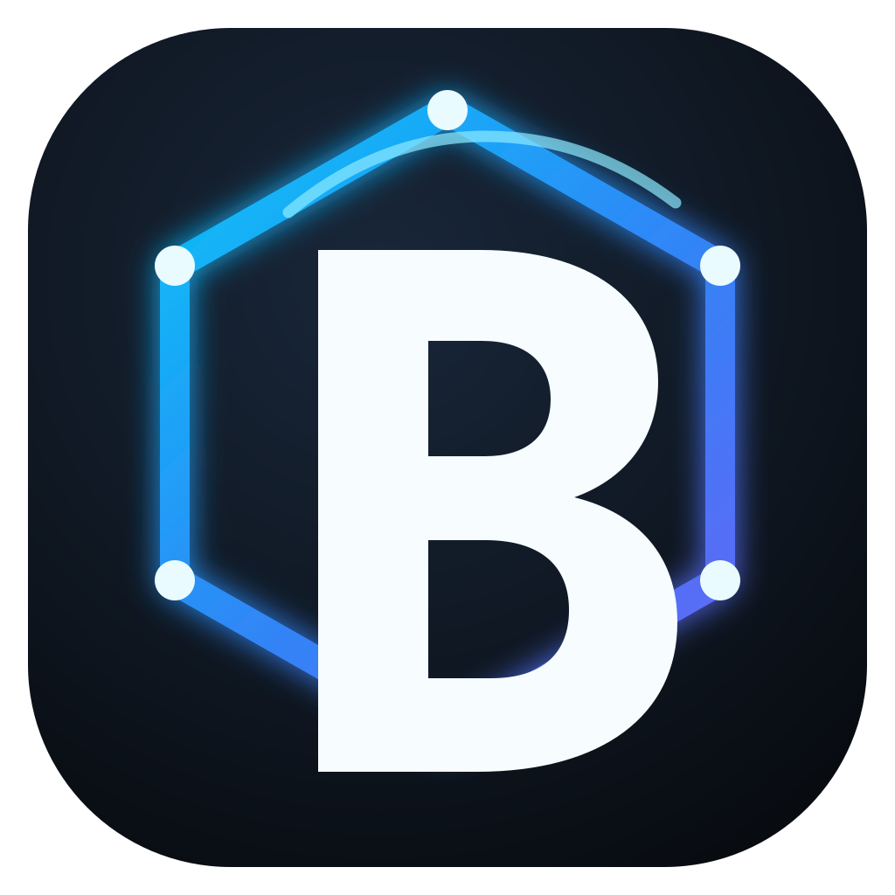
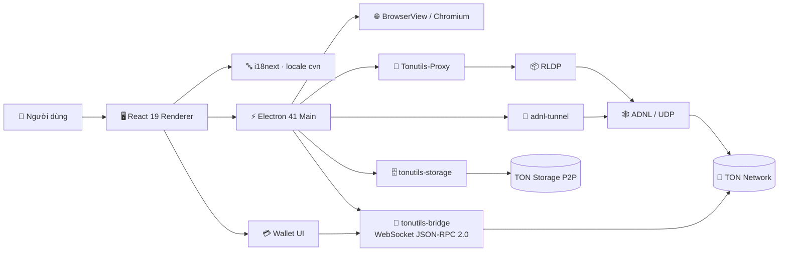

<div align="center">
  

# 🌐 BilaNet

### **Zydf tuh zo · Kogy trugp jan · Mas wuld mov**

**Trình duyệt TON với giao diện CVNSS4.0 — privacy-first, P2P, mã nguồn mở.**

[](https://github.com/TONresistor/Tonnet-Browser)
[](src/renderer/src/locales/cvn)
[](https://www.electronjs.org/)
[](https://react.dev/)
[](LICENSE)

</div>

---

> [!IMPORTANT]
> **BilaNet là lớp bản địa hóa/nhận diện CVNSS4.0 của Tonnet Browser.** Mục tiêu của nhánh này là giữ nguyên kiến trúc, giao thức, thuật toán mạng, ví, bridge, sandbox và daemon của upstream; thay đổi tập trung ở **UI/UX, locale, tên sản phẩm và icon**.

> [!CAUTION]
> **Chưa có kiểm toán bảo mật độc lập.** Tonnet Browser và ví tích hợp được upstream công bố là chưa trải qua audit bên thứ ba. Mã nguồn mở giúp kiểm tra được mã, nhưng không đồng nghĩa với bảo đảm an toàn tuyệt đối. Không nên dùng số tiền lớn trước khi tự đánh giá rủi ro.

## 🧭 BilaNet là gì?

**BilaNet** là một bản trình bày của [TONresistor/Tonnet-Browser](https://github.com/TONresistor/Tonnet-Browser) hướng tới người dùng CVNSS4.0. Thay vì viết lại browser engine hoặc thay giao thức, dự án đưa CVNSS4.0 vào đúng lớp quốc tế hóa (`i18next`) mà upstream đã thiết kế sẵn.

Điểm cốt lõi:

- 🧬 **Giữ lõi upstream** — không viết lại RLDP, ADNL, DHT, proxy, storage daemon, WebSocket bridge hay logic ký ví.
- 🔤 **CVNSS4.0 như một locale mới** — mã ngôn ngữ `cvn`, đủ 8 namespace UI.
- 🛡️ **Privacy-first** — ưu tiên đường hầm nhiều chặng, anti-fingerprinting, cô lập theo miền và xóa dữ liệu.
- 🔗 **Không cần API TON tập trung** — bridge JSON-RPC/WebSocket giao tiếp trực tiếp với TON theo kiến trúc upstream.
- 🌍 **Web3 name service** — `.ton`, `.t.me`, `.adnl`; có thể bật `.eth`/ENS và `.sol`/SNS.
- 📦 **TON Storage P2P** — tải, duyệt và seed dữ liệu theo mạng ngang hàng.
- 💳 **Ví TON tích hợp** — W5/v5r1 và luồng HTTP 402 thử nghiệm.
- 💬 **Messenger thử nghiệm** — khám phá phòng qua DHT và trao đổi P2P theo upstream.
- 📡 **Không telemetry** — triết lý thiết kế không theo dõi người dùng.

## 🔤 CVNSS4.0 trong BilaNet

BilaNet không “dịch chuỗi bằng tay rồi rải trong component”. Upstream đã dùng `i18next` và 8 namespace; BilaNet bổ sung locale `cvn` tương ứng:

```text
src/renderer/src/locales/cvn/
├── common.json      # nút, trạng thái, lỗi chung
├── landing.json     # màn hình kết nối/khởi động
├── browser.json     # thanh địa chỉ, tab, điều hướng, status bar
├── settings.json    # lõi namespace settings
├── settings-cocoon.json       # phần Cocoon (merge vào namespace settings)
├── settings-theme-editor.json # trình biên tập theme (merge vào settings)
├── settings-bridge.json       # bridge/security (merge vào settings)
├── storage.json     # TON Storage
├── pages.json       # start page, storage, history
├── wallet.json      # ví, backup, gửi/nhận, HTTP 402
└── dns.json         # tra cứu DNS TON
```

Nguồn chuyển đổi dùng **CVNSS4.0 Converter 5.0.0-audit-safe**. Bản này giữ API cũ, bảo toàn mọi candidate khi reverse mapping, làm rõ 56 quyết định mơ hồ và xử lý 5 collision mã ngắn quan trọng. Với BilaNet, converter được dùng ở **giai đoạn tạo language pack**, không được chèn vào luồng mạng hay ví.

Ví dụ giao diện:

| Tiếng Việt chuẩn | CVNSS4.0 trong BilaNet |
|---|---|
| Trình duyệt BilaNet | `Trihl zydf BilaNet` |
| Quyền riêng tư | `Qyld rizy tuo` |
| Kết nối Mạng TON | `Cetb noib Magr TON` |
| Cài đặt | `Cail dath` |
| Tải xuống | `Taiz xuzb` |
| Lịch sử | `Likr suv` |

## 🧱 Bản chất kiến trúc



### 1. Renderer — nơi BilaNet thay đổi nhiều nhất

Frontend là **React 19 + TypeScript + Tailwind CSS v4**. BilaNet giữ component tree và state management (Zustand), nhưng đổi resource ngôn ngữ, tên hiển thị và logo. Đây là ranh giới quan trọng giúp việc Việt hóa không tràn vào logic nghiệp vụ.

### 2. Main process — giữ nguyên logic

Electron main process quản lý BrowserView, IPC, tiến trình phụ, proxy, bridge, storage và các chính sách bảo mật. BilaNet không thay đổi thuật toán ở lớp này.

### 3. TON Proxy — đường vào tonsite

`Tonutils-Proxy` làm gateway HTTP cục bộ để nội dung `.ton` được vận chuyển qua **RLDP → ADNL → UDP** thay vì mô hình DNS/HTTP tập trung truyền thống.

### 4. Garlic routing — ẩn nguồn theo nhiều chặng

Khi bật anonymous mode, lưu lượng ADNL được đưa qua `adnl-tunnel`. Mỗi relay chỉ biết hàng xóm trực tiếp của nó; chế độ giao diện hiện hỗ trợ cấu hình tiêu chuẩn và tối đa (2-hop/3-hop theo upstream).

### 5. WebSocket bridge — truy vấn blockchain trực tiếp

`tonutils-bridge` cung cấp JSON-RPC 2.0 qua WebSocket cho renderer/wallet. Mục tiêu của kiến trúc là tránh phụ thuộc bắt buộc vào TonCenter/TonAPI cho luồng chính.

### 6. TON Storage — file P2P

`tonutils-storage` chạy như daemon riêng để tải/seed bag. UI chỉ gửi lệnh và hiển thị trạng thái; khối lưu trữ P2P không bị chỉnh sửa bởi BilaNet.

## 🔐 Mô hình quyền riêng tư & bảo mật

| Lớp | Cơ chế | Ý nghĩa |
|---|---|---|
| 🌰 Định tuyến | Garlic routing, multi-hop | Giảm khả năng một relay biết cả nguồn và đích |
| 🧬 Fingerprint | Canvas/WebGL/Audio, WebRTC controls, generic UA | Giảm dấu vân tay trình duyệt |
| 🧱 Isolation | Cookie/localStorage theo domain | Hạn chế theo dõi chéo miền |
| 🧹 Data lifecycle | Clear-on-exit, cookie auto-delete, history in RAM | Giảm dữ liệu tồn dư trên máy |
| 🚫 Content filter | Ads, trackers, miners, malware, annoyances | Giảm mã theo dõi/nội dung xâm lấn |
| 🧰 Process | Electron sandbox + IPC hardening | Thu hẹp biên tấn công giữa renderer/main |
| 🌐 Network | SSRF protection | Chặn truy cập ADNL tới dải private/loopback theo chính sách |
| 📜 Telemetry | Không telemetry | Không đưa thống kê sử dụng về máy chủ phân tích |

> **Không nên hiểu “privacy-first” là “ẩn danh tuyệt đối”.** Độ riêng tư thực tế phụ thuộc cấu hình, relay, metadata ở đầu cuối, dApp, hệ điều hành và các lỗi chưa được phát hiện.

## 🌐 Tên miền & đường dữ liệu

```text
Người dùng nhập alice.ton
        │
        ▼
TON DNS / resolver
        │
        ▼
Tonutils-Proxy
        │
        ├── P2P trực tiếp ───────┐
        │                        │
        └── adnl-tunnel 2/3 hop ┤
                                 ▼
                           RLDP / ADNL
                                 │
                                 ▼
                            TON tonsite
```

Có thể bật resolver ngoài TON cho `.eth` (ENS) và `.sol` (SNS). Các endpoint RPC bên ngoài là **tùy chọn** và cần được đánh giá riêng về quyền riêng tư.

## 🖼️ Bộ nhận diện BilaNet

Icon mới dùng chữ **B** đặt trong một mạng lục giác 6 nút — gợi ý ba khái niệm: browser, P2P network và privacy boundary.

- `resources/icons/bilanet.svg` — **nguồn vector duy nhất dùng khi build**.
- Electron Builder tự rasterize/chuyển đổi SVG sang định dạng icon phù hợp cho Windows, macOS và Linux.
- Gói tải về kèm thêm `icon.png`, `icon.ico`, `icon.icns` để dùng thủ công hoặc kiểm thử.

## 🧪 Demo HTML offline

Mở trực tiếp:

```text
demo/BilaNet_demo.html
```

Demo mô phỏng đầy đủ khung browser BilaNet: tab, thanh địa chỉ, trạng thái ADNL/RLDP/DHT, start page, bảng Privacy, wallet modal, toggle bảo mật và thao tác điều hướng. Demo **không kết nối ví thật, không gửi giao dịch và không chạy daemon**.

## ⚙️ Build từ mã nguồn

Yêu cầu upstream:

- Node.js 22+
- npm 9+
- Go 1.24+

```bash
git clone https://github.com/xulytiengviet/Bilanet.git
cd Bilanet
npm install
bash scripts/build-binaries-from-source.sh
npm run dev
```

Kiểm tra trước release:

```bash
npm run validate
npm run build:win
npm run build:mac
npm run build:linux:x64
```

## 🖥️ Nền tảng

| Windows | macOS | Linux |
|---|---|---|
| `.exe` / portable | `.dmg` universal | `.AppImage` / `.deb` |

Tên gói build của BilaNet được cấu hình riêng, nhưng helper binaries và giao thức vẫn theo upstream.

## 🧭 Ranh giới thay đổi: Localization-only

### ✅ Được thay đổi

- Chuỗi hiển thị UI/UX
- Locale CVNSS4.0
- Ngôn ngữ mặc định
- Tên BilaNet trên cửa sổ/build
- Icon và tài liệu
- Demo giao diện

### ⛔ Không thay đổi

- RLDP / ADNL / DHT
- Tonutils-Proxy
- adnl-tunnel
- tonutils-bridge
- tonutils-storage
- Thuật toán ví / ký giao dịch
- HTTP 402 payment logic
- IPC/security policies
- Browser process sandboxing

Cách tách này giúp dễ **rebase upstream**: khi Tonnet Browser cập nhật lõi, BilaNet chỉ cần kiểm tra chênh lệch key i18n và branding thay vì duy trì một fork thuật toán sâu.

## 🧩 Quy trình cập nhật locale

```text
Upstream en/*.json
      │
      ├── dịch nghĩa → tiếng Việt chuẩn
      │
      └── CVNSS4.0 Converter 5.0.0-audit-safe
                     │
                     ▼
                cvn/*.json
                     │
                     ▼
               i18next runtime
```

Nguyên tắc: **không chuyển đổi key, placeholder, URL, protocol name, biến nội suy hoặc identifier**. Các token kỹ thuật như `ADNL`, `RLDP`, `DHT`, `DNS`, `ENS`, `SNS`, `WebSocket`, `JSON-RPC`, `GitHub`, `HTTP 402` được bảo toàn byte-identical; chỉ phần ngôn ngữ nhìn thấy bởi người dùng được chuyển sang CVNSS4.0.

## ⚠️ Phạm vi sử dụng

BilaNet/Tonnet Browser được thiết kế trước hết cho dịch vụ trong hệ TON/Web3 tương thích — đặc biệt tonsite và các cơ chế TON. Đây không phải mục tiêu thay thế Chrome/Edge cho toàn bộ web truyền thống.

## 🤝 Upstream & ghi công

BilaNet kế thừa mã nguồn từ **Tonnet Browser** của TONresistor và tiếp tục tuân theo **MIT License**. Các dự án upstream quan trọng gồm:

- [TONresistor/Tonnet-Browser](https://github.com/TONresistor/Tonnet-Browser)
- [TONresistor/Tonutils-Proxy](https://github.com/TONresistor/Tonutils-Proxy)
- [TONresistor/tonutils-bridge](https://github.com/TONresistor/tonutils-bridge)
- [ton-blockchain/adnl-tunnel](https://github.com/ton-blockchain/adnl-tunnel)
- [xssnick/tonutils-storage](https://github.com/xssnick/tonutils-storage)
- [xssnick/tonutils-go](https://github.com/xssnick/tonutils-go)

BilaNet không tuyên bố sở hữu các công nghệ upstream; phần đóng góp của nhánh này tập trung vào **CVNSS4.0 UI/UX, branding, tài liệu và trải nghiệm người dùng**.

## 📄 License

MIT — xem [`LICENSE`](LICENSE).

---

<div align="center">
<strong>BilaNet</strong><br/>
<code>Qyld rizy tuo way tuk thidb ceb</code><br/>
<sub>Privacy by design · Open source · TON native</sub>
</div>
