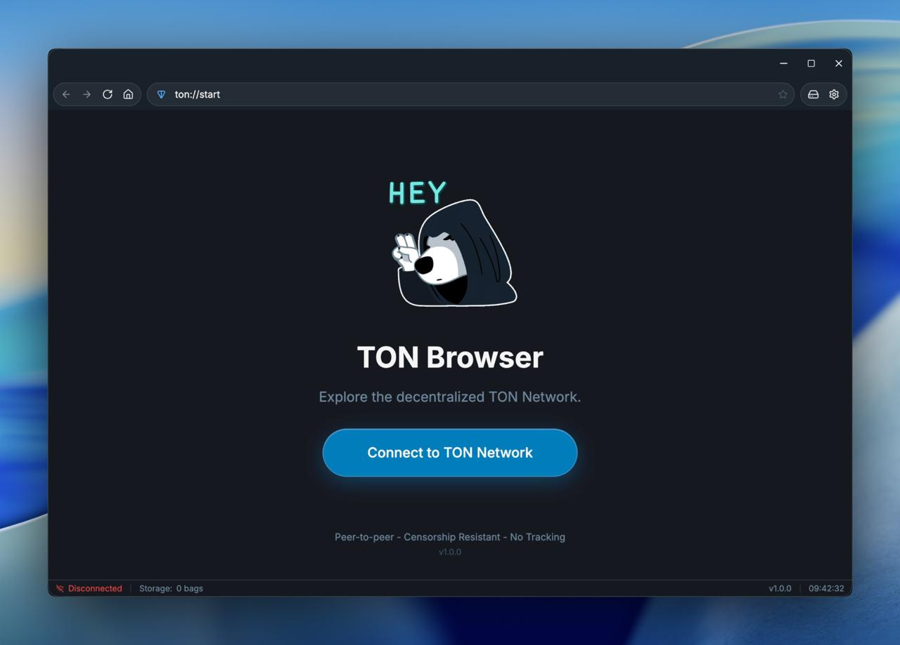
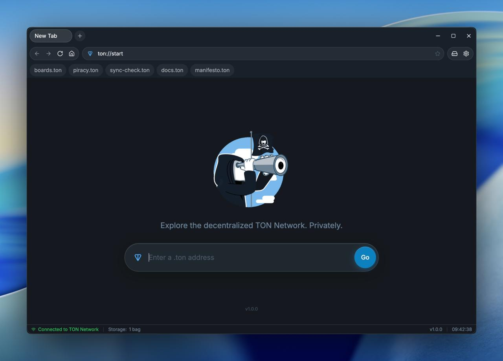
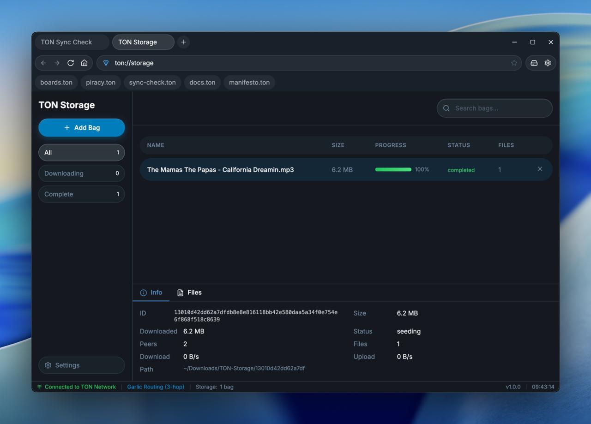
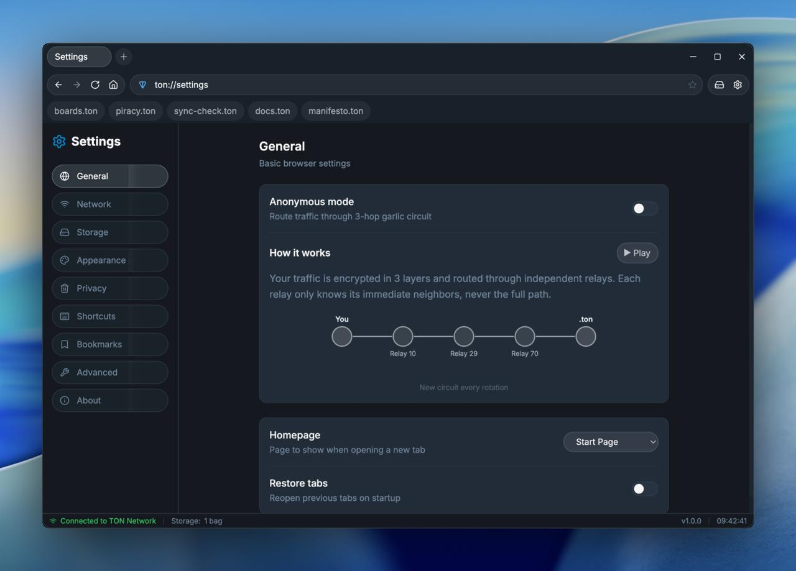

<h1 align="center">Tonnet Browser</h1>

<p align="center">
  <strong>The TON Network Browser</strong>
</p>

<p align="center">
  <a href="#about">About</a> •
  <a href="#features">Features</a> •
  <a href="#-privacy--security">Privacy & Security</a> •
  <a href="#installation">Installation</a> •
  <a href="#usage">Usage</a> •
  <a href="#settings">Settings</a> •
  <a href="#contact">Contact</a>
</p>

<p align="center">
  <a href="https://tonnet.resistance.dog"></a>
  
  
  
</p>

<h3 align="center">Download</h3>

<p align="center">
  <a href="https://tonnet.resistance.dog/download/">
    
  </a>
  &nbsp;
  <a href="https://tonnet.resistance.dog/download/">
    
  </a>
  &nbsp;
  <a href="https://tonnet.resistance.dog/download/">
    
  </a>
</p>

<p align="center">
  <sub>
    <a href="https://tonnet.resistance.dog/download/">Linux .deb</a> ·
    <a href="https://tonnet.resistance.dog/download/">Windows Portable</a> ·
    <a href="https://tonnet.resistance.dog/download/">All releases</a>
  </sub>
</p>

<p align="center">
  <a href="https://tonnet.resistance.dog/download/">tonnet.resistance.dog/download</a>
</p>

---

<table>
  <tr>
    <td align="center"><br><em>Home</em></td>
    <td align="center"><br><em>Start Page</em></td>
  </tr>
  <tr>
    <td align="center"><br><em>Storage</em></td>
    <td align="center"><br><em>Settings</em></td>
  </tr>
</table>

## About

Tonnet Browser is a native desktop browser for the TON Network. It connects directly to `.ton` sites through decentralized TON DNS and RLDP protocol, without centralized gateways or third-party proxies.

## Features

<table>
  <tr>
    <td align="center" width="200"><br><b>Browsing</b><br><br><sub>15 blockchain TLDs<br>Decentralized DNS<br>Tabs, bookmarks, history</sub><br><br></td>
    <td align="center" width="200"><br><b>Wallet</b><br><br><sub>W5 v5r1, send/receive<br>NFT gallery, TON DNS<br>HTTP 402 payments</sub><br><br></td>
    <td align="center" width="200"><br><b>Privacy</b><br><br><sub>3-hop garlic routing<br>Anti-fingerprinting<br>No telemetry</sub><br><br></td>
    <td align="center" width="200"><br><b>Storage</b><br><br><sub>TON Storage client<br>Download and seed<br>Decentralized P2P</sub><br><br></td>
  </tr>
  <tr>
    <td align="center"><br><b>Routing</b><br><br><sub>Auto circuit rotation<br>Direct mode for speed<br>Censorship-resistant</sub><br><br></td>
    <td align="center"><br><b>Fingerprint</b><br><br><sub>Canvas, WebGL, Audio<br>WebRTC leak blocking<br>Generic User-Agent</sub><br><br></td>
    <td align="center"><br><b>Isolation</b><br><br><sub>Per-domain sessions<br>Cookie auto-delete<br>Encrypted history</sub><br><br></td>
    <td align="center"><br><b>Security</b><br><br><sub>Process sandboxing<br>Rate limiting<br>Open source, MIT</sub><br><br></td>
  </tr>
</table>

## Installation

| Platform | Download |
|----------|----------|
| **Windows** | [Installer](https://github.com/TONresistor/Tonnet-Browser/releases/latest/download/TON.Browser.Setup.1.4.2.exe) · [Portable](https://github.com/TONresistor/Tonnet-Browser/releases/latest/download/TON.Browser.1.4.2.exe) |
| **macOS** | [DMG (Universal)](https://github.com/TONresistor/Tonnet-Browser/releases/latest/download/TON.Browser-1.4.2-universal.dmg) |
| **Linux** | [AppImage](https://github.com/TONresistor/Tonnet-Browser/releases/latest/download/TON.Browser-1.4.2.AppImage) · [.deb](https://github.com/TONresistor/Tonnet-Browser/releases/latest/download/ton-browser_1.4.2_amd64.deb) |

### Windows

Your browser may warn that the file is from an unknown source. Click **"Keep"** to download.

1. Download and run **TON.Browser.Setup.1.4.2.exe**
2. Follow the installation prompts
3. Launch **TON Browser** from the Start menu

**One-line install:** Open PowerShell and run:

```powershell
irm https://github.com/TONresistor/Tonnet-Browser/releases/latest/download/TON.Browser.Setup.1.4.2.exe -OutFile TonBrowser.exe; Unblock-File TonBrowser.exe; .\TonBrowser.exe
```

### macOS

Open the `.dmg` and drag TON Browser to Applications.

```bash
# If blocked by Gatekeeper
xattr -cr /Applications/TON\ Browser.app
```

**One-line install:** Open Terminal and run:

```bash
curl -LO https://github.com/TONresistor/Tonnet-Browser/releases/latest/download/TON.Browser-1.4.2-universal.dmg && hdiutil attach TON.Browser-1.4.2-universal.dmg && cp -R "/Volumes/TON Browser/TON Browser.app" /Applications/ && hdiutil detach "/Volumes/TON Browser" && xattr -cr /Applications/TON\ Browser.app && open /Applications/TON\ Browser.app
```

### Linux

```bash
# AppImage
chmod +x TON.Browser-1.4.2.AppImage
./TON.Browser-1.4.2.AppImage

# Debian/Ubuntu
sudo dpkg -i ton-browser_1.4.2_amd64.deb
```

**One-line install:** Open Terminal and run:

```bash
# AppImage
curl -LO https://github.com/TONresistor/Tonnet-Browser/releases/latest/download/TON.Browser-1.4.2.AppImage && chmod +x TON.Browser-1.4.2.AppImage && ./TON.Browser-1.4.2.AppImage

# Debian/Ubuntu
curl -LO https://github.com/TONresistor/Tonnet-Browser/releases/latest/download/ton-browser_1.4.2_amd64.deb && sudo dpkg -i ton-browser_1.4.2_amd64.deb
```

## Usage

1. Launch TON Browser
2. Click **"Connect to TON Network"**
3. Wait for sync to complete (status bar shows "Connected to TON Network")
4. Enter a `.ton` address in the URL bar (e.g., `foundation.ton`)
5. Browse the decentralized web

### TON Storage

1. Navigate to `ton://storage` or click the Storage icon
2. Click **"Add Bag"**
3. Paste a 64-character hex bag ID
4. Monitor download progress in real-time

## Settings

Access settings via the gear icon or navigate to `ton://settings`.

| Category | Settings |
|----------|----------|
| **General** | Homepage, Restore tabs, Anonymous mode, Circuit rotation |
| **Network** | Proxy port, Storage port, Auto-connect, Connection timeout |
| **Storage** | Download path, Update interval |
| **Appearance** | Zoom levels, Bookmarks bar, Status bar, Tab orientation, Themes |
| **Privacy** | Clear browsing data, Clear on exit, Cookie settings, First-party isolation |
| **Content Filtering** | Block ads, trackers, miners, malware, annoyances |
| **History** | History mode, Maximum entries |
| **Shortcuts** | Keyboard shortcuts |
| **Bookmarks** | Manage bookmarks |
| **Advanced** | Verbosity levels, Sync test domain |
| **Wallet** | Payment mode, Spending limits, Per-site policies, API keys |
| **About** | Version, Links |

## Building

### Prerequisites

- Node.js 22+
- npm 9+

### Development

```bash
git clone https://github.com/TONresistor/Tonnet-Browser.git
cd Tonnet-Browser
npm install
npm run dev
```

### Production Build

```bash
# Linux
npm run build:linux

# Windows
npm run build:win

# macOS
npm run build:mac
```

Builds are output to the `release/` directory.

### Tests

```bash
npm test
```

## Tech Stack

| Component | Technology |
|-----------|------------|
| Framework | Electron 39 |
| Frontend | React 19, TypeScript |
| Styling | Tailwind CSS |
| State | Zustand |
| TON Proxy | [tonnet-proxy](https://github.com/TONresistor/tonnet-proxy) |
| TON Storage | [tonutils-storage](https://github.com/xssnick/tonutils-storage) |
| Transport | RLDP over ADNL over UDP |

## Contact

- **Website**: [tonnet.resistance.dog](https://tonnet.resistance.dog)
- **Telegram**: [@zkproof](https://t.me/zkproof)
- **Issues**: [Report bugs or request features](https://github.com/TONresistor/Tonnet-Browser/issues)

## License

MIT License. See [LICENSE](LICENSE) for details.

## Acknowledgments

- [Tor Project](https://www.torproject.org/) - Inspiration for anonymous browsing
- [BitTorrent](https://www.bittorrent.org/) - Inspiration for P2P file sharing
- [tonutils-go](https://github.com/xssnick/tonutils-go) - TON protocol implementation
- [tonnet-proxy](https://github.com/TONresistor/tonnet-proxy) - HTTP proxy with garlic routing for TON sites
- [tonutils-storage](https://github.com/xssnick/tonutils-storage) - TON Storage daemon
